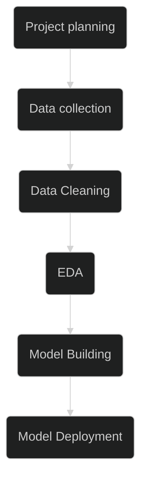

# Salary estimator for a Data analyst job profile

## Workflow 

The following workflow will be followed to build the salary estimator using data science

```mermaid
%%{init: {'theme': 'dark', 'themeCSS': 'svg {background-color: black}'}}%%
flowchart TD
A(Project planning) -->B(Data collection)
    B --> C(Data Cleaning)
    C --> D(EDA)
    D --> E(Model Building)
    E --> F(Model Deployment)
```
