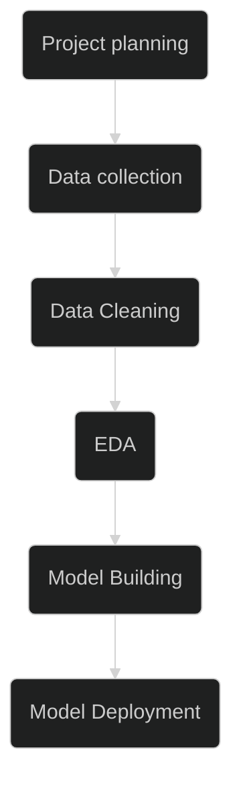

# Salary estimator for a Data analyst job profile

## Motivation

Having a salary estimator for data analyst job profiles is highly advantageous for job seekers. It provides them with valuable insights into salary expectations based on factors such as location, experience, education, and industry. With this information, job seekers can make informed decisions when negotiating their compensation packages, ensuring they receive fair and competitive salaries. The salary estimator empowers job seekers by providing transparency and helping them navigate the job market more effectively, increasing their chances of securing positions that align with their salary expectations and career goals.

## Workflow 

The following workflow will be followed to build the salary estimator using data science

## Project planning

1. Develop a data-driven salary estimator for data analysts job profiles using data science techniques.
2. Collect and aggregate relevant salary data, including location, experience, education, and industry from glassdoor using web scrapping
3. Preprocess and clean the data to ensure quality and integrity.
4. Perform feature engineering to identify key factors influencing salaries.
5. Train a predictive model using machine learning algorithms.
6. Evaluate the model's performance using appropriate metrics.
7. Build a user-friendly interface for users to input their details and receive salary estimates.
8. Conduct thorough testing and validation of the salary estimator.
9. Ensure accuracy and reliability of the estimator.
10. Deliver a documented report on the methodology, results, and limitations of the salary estimator. 

## Data collection

Data is collected from job hosting websites like glassdoor and gehalt.de using web scrapping. Two popular packages used to scrap web data are 
*[Link text Here](https://www.crummy.com/software/BeautifulSoup/bs4/doc/)'bealútiful soup' and 
*[Link text Here](https://saucelabs.com/selenium-getting-started?utm_source=google&utm_medium=paidsearch&utm_campaign=emea_google_nonbrand-framework_DE_english&utm_term=selenium&gad=1&gclid=EAIaIQobChMIs_LSrtTt_wIVP4lQBh3eDA0BEAAYASAAEgIOwfD_BwE)'selinium'. In this project selinium is used to scrap web data.

