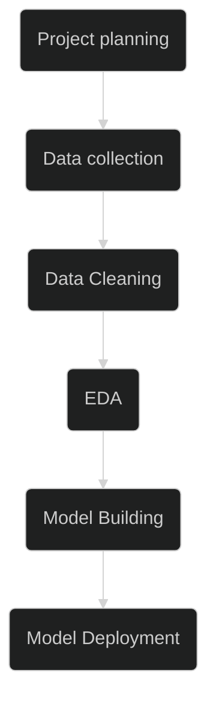

# Salary estimator for a Data analyst job profile

## Motivation

Having a salary estimator for data analyst job profiles is highly advantageous for job seekers. It provides them with valuable insights into salary expectations based on factors such as location, experience, education, and industry. With this information, job seekers can make informed decisions when negotiating their compensation packages, ensuring they receive fair and competitive salaries. The salary estimator empowers job seekers by providing transparency and helping them navigate the job market more effectively, increasing their chances of securing positions that align with their salary expectations and career goals.

## Workflow 

The following workflow will be followed to build the salary estimator using data science

